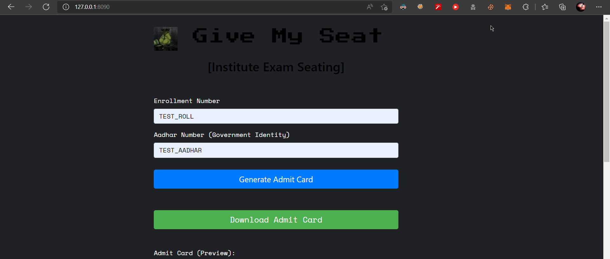
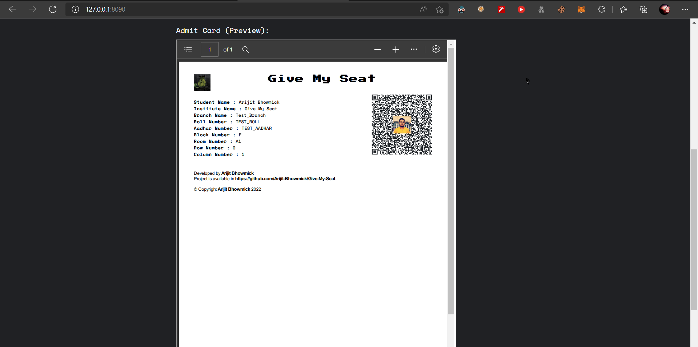
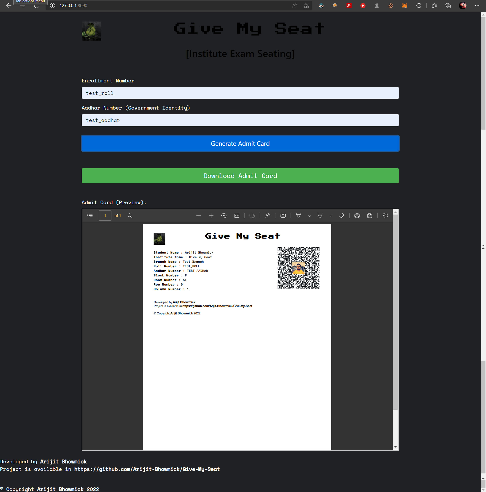

# Give-My-Seat
## [Institute Exam Seating] [Generate Admit Card]
---

### Script Usage

```
python app.py <host> <port> <Number_of_process_to_use> <Institute_Name> <confirmed_seating_path> <wkhtmltopdf_path> <qr_embed_img_path> <pdf_logo_webaddress>
```

Example:

```
python3 app.py 127.0.0.1 8090 3 "Give My Seat" .\confirmed_seating_data.json .\wkhtmltox\bin\wkhtmltopdf.exe .\sample_images\icon.jpg https://avatars.githubusercontent.com/u/66935336?v=4
```

### Production Server
`waitress` is used as a `WSGI (Web Server Gateway Interface)` 

### Web App Usage

After Entering `Roll Number` and `Aadhar Number`
click on `Generate Admit Card` Button.

Wait for a bit, if everything went well then a Admit Card will be generated for preview.
Then Click on `Download Admit Card` to download the Admit Card as PDF Format


### Web App Preview

<!-- 
 -->


### Want to change images in PDF ?

1. Update `logo_link` variable value with the local image (jpg) link you want to embed.
2. Update `pdf_logo` variable value with Icon Image link (Not with the local image) you want to embed.

### Error Fixing
If you do fix any error regarding `wkhtmltopdf` error
Please do use https://wkhtmltopdf.org/ to download
and refer the `wkhtmltopdf` binary path in the `wkhtmltopdf_path` variable in `app.py` script.
